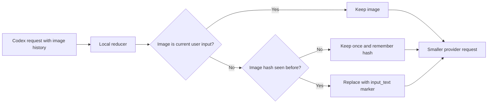

# Codex CLI Image Replay Reducer

A zero-dependency localhost proxy that prevents Codex CLI from repeatedly sending large base64 image payloads in later Responses API requests.

It targets [Codex issue #28316](https://github.com/openai/codex/issues/28316), where one uploaded screenshot can remain in historical tool/message context and be resent on every follow-up.

## Why it saves tokens

Without the reducer, a later request may contain the complete image again:

```text
7 MB screenshot × 10 follow-up requests = roughly 70 MB of repeated input
```

The reducer keeps the image for the current turn, then replaces repeated historical copies with a compact marker:

```json
{
  "type": "input_text",
  "text": "[image omitted from history; sha256=...; media_type=image/png; bytes=7340032]"
}
```

This removes the base64 image bytes before they reach the provider. The terminal reports an approximate saving using `removed_bytes / 4`.



## Setup

Requirements: Node.js 20 or newer, Codex CLI, and an API-key-authenticated OpenAI-compatible Responses provider.

Start the proxy from this project directory:

```powershell
node .\bin\image-reducer.mjs start `
  --listen 127.0.0.1:8787 `
  --upstream https://api.openai.com/v1
```

Set the provider key in the same PowerShell process that launches Codex:

```powershell
$env:OPENAI_API_KEY = "sk-your-key"
```

Create `%USERPROFILE%\.codex\image-reducer.config.toml`:

```toml
model_provider = "image_reducer"
model = "gpt-5.4"

[model_providers.image_reducer]
name = "OpenAI through Image Reducer"
base_url = "http://127.0.0.1:8787"
wire_api = "responses"
env_key = "OPENAI_API_KEY"
supports_websockets = false
```

Start a new Codex session using the profile:

```powershell
codex --profile image-reducer
```

The proxy accepts both `/responses` and `/v1/responses`, then forwards filtered requests to the upstream provider’s `/v1/responses` endpoint.

## Use and verify

1. Attach an image and ask Codex to inspect it.
2. Send a text-only follow-up in the same session.
3. Watch the proxy terminal.

Expected metrics:

```text
image-reducer request=1
images_passed=1
images_replaced=0
bytes_removed=0
request_bytes=52550->52550
estimated_tokens_saved=0

image-reducer request=2
images_passed=0
images_replaced=2
bytes_removed=4340
request_bytes=56449->52331
estimated_tokens_saved=1085
```

`images_replaced` should increase and the later request should be smaller. Explicitly attaching an image again in the newest user message preserves it.

## Existing polluted sessions

To strip historical images immediately on the first intercepted request:

```powershell
node .\bin\image-reducer.mjs start `
  --listen 127.0.0.1:8787 `
  --upstream https://api.openai.com/v1 `
  --bootstrap=strip-history
```

Start this before resuming the session. The mode may omit a screenshot produced mid-turn; normal operation is safest when the proxy starts before Codex.

## Optional visual features

The default reducer is the smallest and safest mode. Optional flags extend what the model can recover from historical images:

```powershell
--visual-memory=summary   # Keep a compact model-generated visual summary
--session-image-cache     # Keep recent images encrypted in process memory
--auto-reinspect          # Let the model select a cached image to restore
```

`--auto-reinspect` enables the other two modes. These features add model calls and memory use; use them only when text summaries are insufficient for later visual questions.

## Scope and privacy

- Only `data:image/*;base64,...` payloads are reduced.
- Text, tool IDs, PDFs, remote image URLs, and request ordering are retained.
- Image bytes are never written to disk.
- Default mode stores only bounded in-memory hash metadata.
- Optional session caching stores encrypted image bytes only in process memory; the key and cache disappear when the proxy stops.
- Authorization headers are forwarded, not logged or persisted.
- Stop the proxy with `Ctrl+C`.

Run the automated checks with:

```powershell
node --test
```
