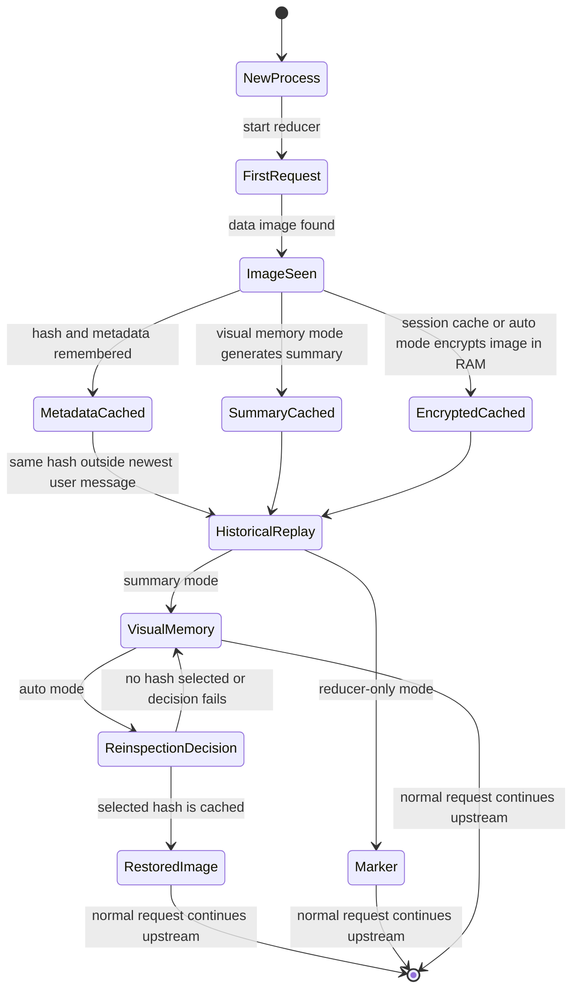
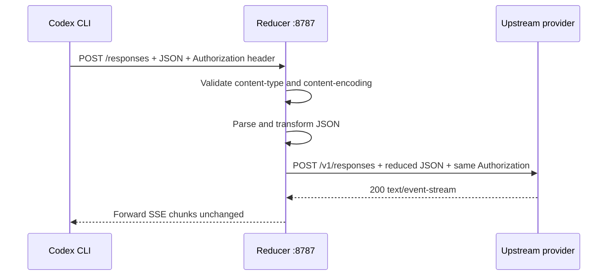

# Codex CLI Image Replay Reducer

## Product purpose

The Image Replay Reducer is a local, zero-runtime-dependency HTTP proxy for Codex CLI sessions that use an OpenAI-compatible Responses provider.

It targets OpenAI Codex issue [#28316](https://github.com/openai/codex/issues/28316): an uploaded image is correctly sent once, but its full `data:image/...;base64,...` payload can remain in historical tool/message input and be replayed on every later request. A single screenshot can therefore turn a normal follow-up into a multi-megabyte request.

The reducer sits between Codex and the provider. It preserves the image in the current user turn, but can replace repeated historical image content with a compact visual-memory summary before the request reaches the provider.

```text
Codex CLI  ── POST /responses ──▶  localhost reducer  ── filtered POST /v1/responses ──▶  OpenAI-compatible provider
                                      │
                                      ├─ current user image: preserve
                                      ├─ first-seen tool image: preserve once
                                      └─ repeated historical image: input_text marker
```

## Problem demonstrated

### Before the reducer

```json
{
  "input": [
    {
      "role": "tool",
      "content": [
        {
          "type": "input_image",
          "image_url": "data:image/png;base64,<millions-of-characters>"
        }
      ]
    },
    { "role": "user", "content": "Inspect it again" }
  ]
}
```

The image is historical, but its original base64 bytes are still part of the next request. Repeating this across turns grows context and provider input-token usage.

### After the reducer

```json
{
  "input": [
    {
      "role": "tool",
      "content": [
        {
          "type": "input_text",
          "text": "[image omitted from history; sha256=2cf24dba5...; media_type=image/png; bytes=5]"
        }
      ]
    },
    { "role": "user", "content": "Inspect it again" }
  ]
}
```

The replacement is deliberately an `input_text` item. It is not placed in `image_url`, because the Responses API validates `image_url` as a URL and rejects arbitrary marker text.

## End-to-end request flow

```mermaid
flowchart LR
    A[Codex CLI] -->|POST /responses or /v1/responses| B[Local reducer<br/>127.0.0.1:8787]
    B --> C{Request method/path?}
    C -->|Non-Responses request| D[Transparent proxy forwarding]
    C -->|POST Responses| E{Content encoding and type valid?}
    E -->|No| F[415 rejected locally<br/>never forwarded]
    E -->|Yes| G[Read JSON body<br/>max 64 MiB]
    G -->|Malformed or too large| H[400 or 413<br/>never forwarded]
    G -->|Valid JSON| I[Find newest role=user message]
    I --> J{Visual memory or auto reinspection?}
    J -->|Yes| K[Create missing image summaries]
    K --> L{Auto reinspection and historical summaries?}
    L -->|Yes| M[Ask model which hashes need original pixels]
    L -->|No| N[Walk nested input/content/tool values]
    M --> N
    J -->|No| N
    N --> O{Image data URL?}
    O -->|No| P[Retain value exactly]
    O -->|Yes, selected for reinspection| Q[Restore encrypted cached image]
    O -->|Yes, current user item| R[Preserve bytes]
    O -->|Yes, historical image| S[Replace with marker or visual memory]
    P --> T[Re-serialize JSON]
    Q --> T
    R --> T
    S --> T
    T --> U[Forward to upstream /v1/responses]
    U --> V[Pipe status, headers, and SSE bytes back to Codex]
```



## Lifecycle and state model

The reducer has one in-memory `ImageLru` per running process. By default it stores metadata only:

```text
hash → { mediaType, byteCount, firstSeenAt }
```

It never writes image bytes, prompts, authorization headers, or transcripts to disk. The default cache capacity is 2,048 hashes. When the capacity is exceeded, the least-recently-used metadata entry is removed.

Use `--session-image-cache` to additionally retain up to 64 recent original images for the lifetime of the reducer process. Each image is encrypted in memory with AES-256-GCM using a fresh random key that also exists only in that process. No cache file, key file, or transcript is created. On a clean server shutdown cached buffers and the key are zeroed; on process termination the operating system releases the process memory. Historical requests continue to use the marker or visual-memory summary unless `--auto-reinspect` is enabled.



### Preservation rule

The newest object with `role: "user"` is identified by walking the complete JSON tree. Image content under that object is always preserved. This allows a user to explicitly re-attach an image after it was previously reduced.

### Historical rule

For content items such as:

```json
{ "type": "input_image", "image_url": "data:image/png;base64,..." }
```

the reducer computes a SHA-256 digest over decoded image bytes. The first occurrence is forwarded and remembered. A later occurrence with the same digest outside the newest user message is converted to:

```json
{ "type": "input_text", "text": "[image omitted from history; ...]" }
```

This keeps the request schema valid while removing the large binary payload.

### Visual-memory mode

Start with `--visual-memory=summary` to preserve useful visual knowledge when historical images are reduced:

```powershell
node .\bin\image-reducer.mjs start `
  --listen 127.0.0.1:8787 `
  --upstream https://api.openai.com/v1 `
  --visual-memory=summary
```

For each image hash without a cached summary, the reducer makes one additional non-stored Responses request while the original image is available. The request asks the vision model to record readable text, numbers, layout, objects, relationships, controls, and uncertainty in at most 1,200 output tokens. The original image is still forwarded on the current turn. Later historical copies become an `input_text` item containing the hash metadata and that summary.

The summary is held in the process-local LRU and is never written to disk by default. If summary generation fails, the original image is forwarded and the historical replacement falls back to the existing marker.

### Automatic reinspection

`--auto-reinspect` enables visual-memory summaries and the encrypted session image cache automatically:

```powershell
node .\bin\image-reducer.mjs start `
  --listen 127.0.0.1:8787 `
  --upstream https://api.openai.com/v1 `
  --auto-reinspect
```

When a later request contains a historical visual-memory item, the reducer makes one small non-streamed decision request containing the latest user text and the available summaries. If the model selects a hash because the summary lacks the needed detail, the reducer decrypts only that cached image and restores it in the normal upstream request. The normal request, including SSE streaming, is then passed through unchanged.

This is intentionally conservative: the decision request may select no image, may select more than one image, and falls back to text-only visual memory if it fails or returns invalid JSON. It adds one provider request only when the current request contains a historical image with a summary. The reducer never writes the raw image or encryption key to disk.

## Image recognition and replacement

The recognized pattern is intentionally narrow:

```regex
^data:(image\/[a-z0-9.+-]+);base64,([A-Za-z0-9+/]+={0,2})$
```

Recognized:

- `data:image/png;base64,...`
- `data:image/jpeg;base64,...`
- `data:image/webp;base64,...`
- Other valid `image/*` media types using base64

Not recognized or changed:

- Ordinary text containing base64-looking characters
- `data:application/pdf;base64,...`
- Remote URLs such as `https://example.com/image.png`
- Non-image tool output
- Text, tool IDs, ordering, and unrelated JSON fields

The marker includes enough metadata for diagnostics without placing source bytes in the forwarded request. In default mode the reducer does not retain those bytes; the optional session cache retains encrypted bytes only in process memory:

```text
[image omitted from history;
 sha256=<decoded-byte digest>;
 media_type=<image MIME type>;
 bytes=<decoded byte count>]
```

## URL and provider routing

Codex custom providers may send requests to `/responses` when the configured provider base URL is the local proxy. The reducer accepts both common paths:

| Codex request path | Upstream base URL | Forwarded upstream path |
|---|---|---|
| `/responses` | `https://api.openai.com/v1` | `/v1/responses` |
| `/v1/responses` | `https://api.openai.com/v1` | `/v1/responses` |

All non-Responses paths are forwarded transparently using the upstream URL. Responses from the provider—including streaming SSE bodies—are piped back without parsing or rewriting.



The reducer does not authenticate with the provider itself. It forwards the incoming `Authorization` header, so the API key remains owned by Codex’s process environment.

Visual-memory summary and reinspection-decision requests are separate, non-streamed Responses requests made directly to the configured upstream with the same `Authorization` header. The final user-facing request retains its original streaming behavior.

## Bootstrap mode

Use `--bootstrap=strip-history` when starting against a session that already contains historical images. On the first intercepted Responses request, image content outside the newest user message is reduced immediately, even if its hash is not yet in the fresh process cache.

```powershell
node .\bin\image-reducer.mjs start `
  --listen 127.0.0.1:8787 `
  --upstream https://api.openai.com/v1 `
  --bootstrap=strip-history
```

Start the reducer before resuming the session. A tool screenshot produced in the middle of an already-running turn can be indistinguishable from old history during bootstrap; normal operation avoids that ambiguity by starting the proxy before Codex.

## Metrics and terminal output

Every transformed request produces local metrics. The formatted terminal output is intentionally human-readable and does not include prompt content:

```text
image-reducer request=2
images_passed=0
images_replaced=2
bytes_removed=4340
request_bytes=56449->52331
estimated_tokens_saved=1085
```

Metric meanings:

| Metric | Meaning |
|---|---|
| `request` | Sequential request number for this reducer process |
| `images_passed` | Image payloads forwarded unchanged in this request |
| `images_replaced` | Historical image items converted to markers or visual-memory text |
| `bytes_removed` | Original image data-URL string bytes removed |
| `request_bytes` | Serialized JSON size before and after transformation |
| `estimated_tokens_saved` | Rough estimate using `bytes_removed / 4`; not provider billing telemetry |

Summary and reinspection-decision calls are intentionally excluded from these per-request forwarding metrics. In automatic mode, `images_passed` can be nonzero on a historical follow-up because the reducer selected and restored a cached image.

Variable names are emitted in green ANSI text; separators and values remain white. If output is redirected to a non-color-aware sink, the underlying metric text is unchanged apart from ANSI escape sequences.

## Configuration

Start the proxy from the project root:

```powershell
node .\bin\image-reducer.mjs start `
  --listen 127.0.0.1:8787 `
  --upstream https://api.openai.com/v1 `
  --auto-reinspect
```

| Flag | Effect |
|---|---|
| No optional flag | Replace repeated historical images with a small marker. |
| `--visual-memory=summary` | Generate and retain text summaries for historical replacements. |
| `--session-image-cache` | Retain up to 64 recent images encrypted in process memory; no automatic resend. |
| `--auto-reinspect` | Enable summaries, encrypted session cache, and model-selected automatic image restore. |

Configure a Codex profile at `%USERPROFILE%\.codex\image-reducer.config.toml`:

```toml
model_provider = "image_reducer"
model = "gpt-5.4"

[model_providers.image_reducer]
name = "OpenAI through Image Reducer"
base_url = "http://127.0.0.1:8787"
wire_api = "responses"
env_key = "OPENAI_API_KEY"
supports_websockets = false
```

The API key must exist in the same PowerShell process that launches Codex:

```powershell
$env:OPENAI_API_KEY = "sk-your-key"
codex --profile image-reducer
```

Environment variables are process-scoped; setting a variable in one terminal or using `setx` does not update an already-running Codex process.

## Failure behavior and safety boundaries

| Condition | Reducer behavior | Provider contacted? |
|---|---|---|
| Valid JSON Responses request | Transform and forward | Yes |
| Non-JSON Responses request | Return `415` | No |
| Compressed Responses request | Return `415` | No |
| Malformed JSON | Return `400` | No |
| Body larger than 64 MiB | Return `413` | No |
| Visual-memory summary request fails | Forward current image; use marker for later history | Yes, main request |
| Reinspection decision fails or is invalid | Send visual-memory text only | Yes, main request |
| Selected image is not in the session cache | Preserve the image already present in the incoming request, if available | Yes |
| Upstream connection failure | Return `502` or destroy an already-streaming response | Attempted |
| Non-Responses request | Transparent forward | Yes |

The proxy deliberately buffers and parses the Responses request body before forwarding it. This is required to inspect historical JSON but means the configured 64 MiB limit applies to the incoming request body.

## Verification workflow

### Automated tests

Run:

```powershell
node --test
```

The test suite verifies:

1. Newest-user images remain byte-for-byte intact.
2. Nested content arrays are traversed.
3. Known historical images become valid `input_text` items.
4. Explicit re-uploads remain images.
5. Ordinary base64, PDFs, and remote URLs are unchanged.
6. Bootstrap mode strips historical image data.
7. Session-cache ciphertext can be restored and is cleared on shutdown.
8. Session caching does not change normal historical reduction.
9. Visual-memory summaries replace historical image payloads.
10. Automatic reinspection restores only the model-selected cached image.
11. `/responses` routing reaches the upstream and streaming responses pass through unchanged.
12. Compressed and malformed requests are rejected locally.

### Manual Codex test

Use two terminals.

Terminal 1:

```powershell
node .\bin\image-reducer.mjs start `
  --listen 127.0.0.1:8787 `
  --upstream https://api.openai.com/v1 `
  --auto-reinspect
```

Terminal 2:

```powershell
$env:OPENAI_API_KEY = "sk-your-key"
codex --profile image-reducer
```

Attach an image and ask Codex to inspect it. Then send a text-only follow-up that requests a detail omitted from the summary, such as `What is the tiny status label in the top-right?`. The first terminal should show an initial `images_passed` count. The follow-up can show `images_passed=1` when automatic reinspection restores the selected image, or `images_replaced=1` when the summary alone is sufficient.

## Deliberate scope

This product is a request-time reducer for Codex CLI custom Responses providers. It is not:

- A ChatGPT desktop interception layer
- A replacement for Codex’s native image handling
- A transcript/session-file repair utility
- A generic binary or PDF sanitizer
- A provider-side token accounting system
- A lossless visual memory system; summaries cannot guarantee answers about pixels they did not describe

The central invariant is simple:

> A newly supplied image remains available to the model; an unchanged historical image does not consume its full base64 payload on every subsequent request.
