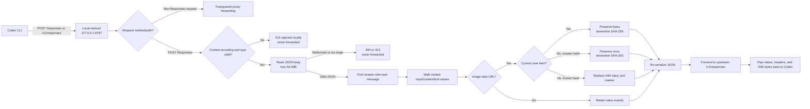
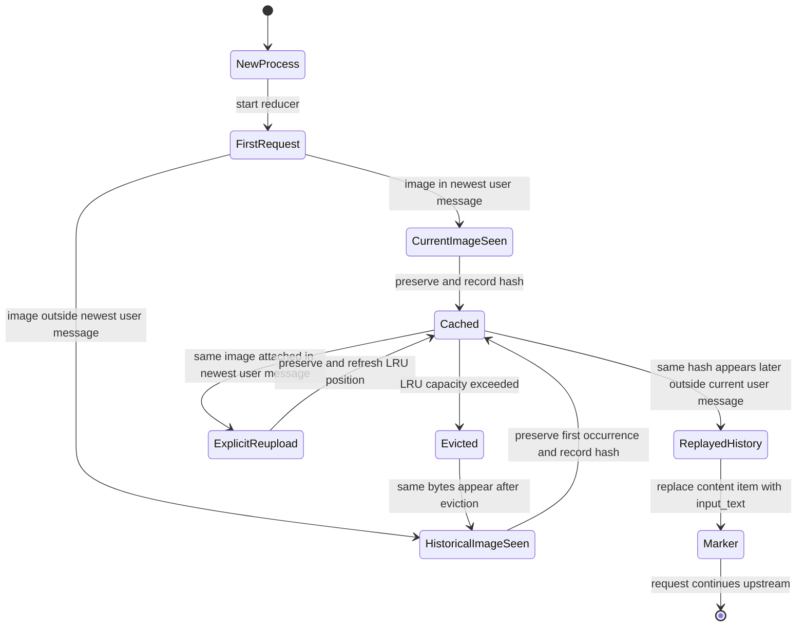
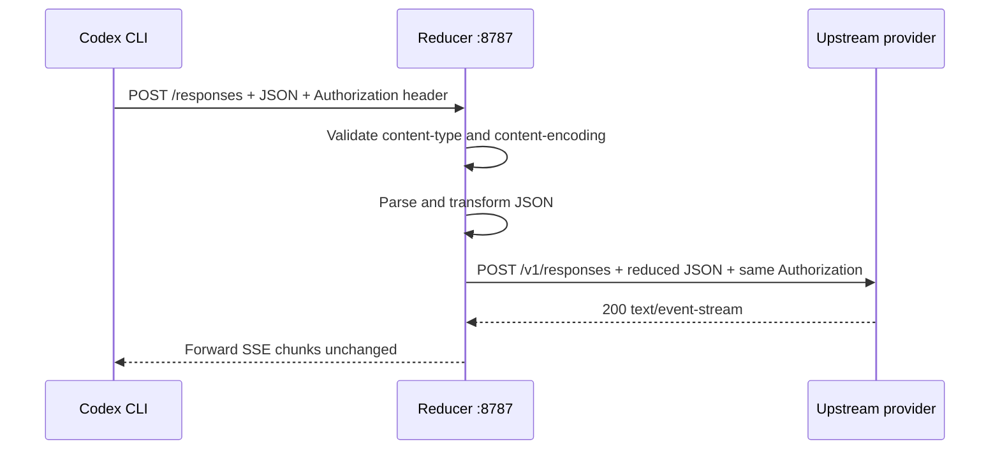

# Codex CLI Image Replay Reducer

## Product purpose

The Image Replay Reducer is a local, zero-runtime-dependency HTTP proxy for Codex CLI sessions that use an OpenAI-compatible Responses provider.

It targets OpenAI Codex issue [#28316](https://github.com/openai/codex/issues/28316): an uploaded image is correctly sent once, but its full `data:image/...;base64,...` payload can remain in historical tool/message input and be replayed on every later request. A single screenshot can therefore turn a normal follow-up into a multi-megabyte request.

The reducer sits between Codex and the provider. It preserves the image in the current user turn, but replaces repeated historical image content with a small textual marker before the request reaches the provider.

```text
Codex CLI  ── POST /responses ──▶  localhost reducer  ── filtered POST /v1/responses ──▶  OpenAI-compatible provider
                                      │
                                      ├─ current user image: preserve
                                      ├─ first-seen tool image: preserve once
                                      └─ repeated historical image: input_text marker
```

## Problem demonstrated

### Before the reducer

```json
{
  "input": [
    {
      "role": "tool",
      "content": [
        {
          "type": "input_image",
          "image_url": "data:image/png;base64,<millions-of-characters>"
        }
      ]
    },
    { "role": "user", "content": "Inspect it again" }
  ]
}
```

The image is historical, but its original base64 bytes are still part of the next request. Repeating this across turns grows context and provider input-token usage.

### After the reducer

```json
{
  "input": [
    {
      "role": "tool",
      "content": [
        {
          "type": "input_text",
          "text": "[image omitted from history; sha256=2cf24dba5...; media_type=image/png; bytes=5]"
        }
      ]
    },
    { "role": "user", "content": "Inspect it again" }
  ]
}
```

The replacement is deliberately an `input_text` item. It is not placed in `image_url`, because the Responses API validates `image_url` as a URL and rejects arbitrary marker text.

## End-to-end request flow



## Lifecycle and state model

The reducer has one in-memory `ImageLru` per running process. It stores metadata only:

```text
hash → { mediaType, byteCount, firstSeenAt }
```

It never writes image bytes, prompts, authorization headers, or transcripts to disk. The default cache capacity is 2,048 hashes. When the capacity is exceeded, the least-recently-used metadata entry is removed.



### Preservation rule

The newest object with `role: "user"` is identified by walking the complete JSON tree. Image content under that object is always preserved. This allows a user to explicitly re-attach an image after it was previously reduced.

### Historical rule

For content items such as:

```json
{ "type": "input_image", "image_url": "data:image/png;base64,..." }
```

the reducer computes a SHA-256 digest over decoded image bytes. The first occurrence is forwarded and remembered. A later occurrence with the same digest outside the newest user message is converted to:

```json
{ "type": "input_text", "text": "[image omitted from history; ...]" }
```

This keeps the request schema valid while removing the large binary payload.

## Image recognition and replacement

The recognized pattern is intentionally narrow:

```regex
^data:(image\/[a-z0-9.+-]+);base64,([A-Za-z0-9+/]+={0,2})$
```

Recognized:

- `data:image/png;base64,...`
- `data:image/jpeg;base64,...`
- `data:image/webp;base64,...`
- Other valid `image/*` media types using base64

Not recognized or changed:

- Ordinary text containing base64-looking characters
- `data:application/pdf;base64,...`
- Remote URLs such as `https://example.com/image.png`
- Non-image tool output
- Text, tool IDs, ordering, and unrelated JSON fields

The marker includes enough metadata for diagnostics without retaining the source bytes:

```text
[image omitted from history;
 sha256=<decoded-byte digest>;
 media_type=<image MIME type>;
 bytes=<decoded byte count>]
```

## URL and provider routing

Codex custom providers may send requests to `/responses` when the configured provider base URL is the local proxy. The reducer accepts both common paths:

| Codex request path | Upstream base URL | Forwarded upstream path |
|---|---|---|
| `/responses` | `https://api.openai.com/v1` | `/v1/responses` |
| `/v1/responses` | `https://api.openai.com/v1` | `/v1/responses` |

All non-Responses paths are forwarded transparently using the upstream URL. Responses from the provider—including streaming SSE bodies—are piped back without parsing or rewriting.



The reducer does not authenticate with the provider itself. It forwards the incoming `Authorization` header, so the API key remains owned by Codex’s process environment.

## Bootstrap mode

Use `--bootstrap=strip-history` when starting against a session that already contains historical images. On the first intercepted Responses request, image content outside the newest user message is reduced immediately, even if its hash is not yet in the fresh process cache.

```powershell
node .\bin\image-reducer.mjs start `
  --listen 127.0.0.1:8787 `
  --upstream https://api.openai.com/v1 `
  --bootstrap=strip-history
```

Start the reducer before resuming the session. A tool screenshot produced in the middle of an already-running turn can be indistinguishable from old history during bootstrap; normal operation avoids that ambiguity by starting the proxy before Codex.

## Metrics and terminal output

Every transformed request produces local metrics. The formatted terminal output is intentionally human-readable and does not include prompt content:

```text
image-reducer request=2
images_passed=0
images_replaced=2
bytes_removed=4340
request_bytes=56449->52331
estimated_tokens_saved=1085
```

Metric meanings:

| Metric | Meaning |
|---|---|
| `request` | Sequential request number for this reducer process |
| `images_passed` | Image payloads forwarded unchanged in this request |
| `images_replaced` | Historical image items converted to text markers |
| `bytes_removed` | Original image data-URL string bytes removed |
| `request_bytes` | Serialized JSON size before and after transformation |
| `estimated_tokens_saved` | Rough estimate using `bytes_removed / 4`; not provider billing telemetry |

Variable names are emitted in green ANSI text; separators and values remain white. If output is redirected to a non-color-aware sink, the underlying metric text is unchanged apart from ANSI escape sequences.

## Configuration

Start the proxy from the project root:

```powershell
node .\bin\image-reducer.mjs start `
  --listen 127.0.0.1:8787 `
  --upstream https://api.openai.com/v1
```

Configure a Codex profile at `%USERPROFILE%\.codex\image-reducer.config.toml`:

```toml
model_provider = "image_reducer"
model = "gpt-5.4"

[model_providers.image_reducer]
name = "OpenAI through Image Reducer"
base_url = "http://127.0.0.1:8787"
wire_api = "responses"
env_key = "OPENAI_API_KEY"
supports_websockets = false
```

The API key must exist in the same PowerShell process that launches Codex:

```powershell
$env:OPENAI_API_KEY = "sk-your-key"
codex --profile image-reducer
```

Environment variables are process-scoped; setting a variable in one terminal or using `setx` does not update an already-running Codex process.

## Failure behavior and safety boundaries

| Condition | Reducer behavior | Provider contacted? |
|---|---|---|
| Valid JSON Responses request | Transform and forward | Yes |
| Non-JSON Responses request | Return `415` | No |
| Compressed Responses request | Return `415` | No |
| Malformed JSON | Return `400` | No |
| Body larger than 64 MiB | Return `413` | No |
| Upstream connection failure | Return `502` or destroy an already-streaming response | Attempted |
| Non-Responses request | Transparent forward | Yes |

The proxy deliberately buffers and parses the Responses request body before forwarding it. This is required to inspect historical JSON but means the configured 64 MiB limit applies to the incoming request body.

## Verification workflow

### Automated tests

Run:

```powershell
node --test
```

The test suite verifies:

1. Newest-user images remain byte-for-byte intact.
2. Nested content arrays are traversed.
3. Known historical images become valid `input_text` items.
4. Explicit re-uploads remain images.
5. Ordinary base64, PDFs, and remote URLs are unchanged.
6. Bootstrap mode strips historical image data.
7. `/responses` routing reaches the upstream.
8. Streaming responses pass through unchanged.
9. Compressed and malformed requests are rejected locally.

### Manual Codex test

Use two terminals.

Terminal 1:

```powershell
node .\bin\image-reducer.mjs start `
  --listen 127.0.0.1:8787 `
  --upstream https://api.openai.com/v1
```

Terminal 2:

```powershell
$env:OPENAI_API_KEY = "sk-your-key"
codex --profile image-reducer
```

Attach an image and ask Codex to inspect it. Then send a text-only follow-up such as `Inspect it again pls`. The first terminal should show an initial `images_passed` count and a later `images_replaced` count with a smaller `request_bytes` result.

## Deliberate scope

This product is a request-time reducer for Codex CLI custom Responses providers. It is not:

- A ChatGPT desktop interception layer
- A replacement for Codex’s native image handling
- A transcript/session-file repair utility
- A generic binary or PDF sanitizer
- A provider-side token accounting system

The central invariant is simple:

> A newly supplied image remains available to the model; an unchanged historical image does not consume its full base64 payload on every subsequent request.

